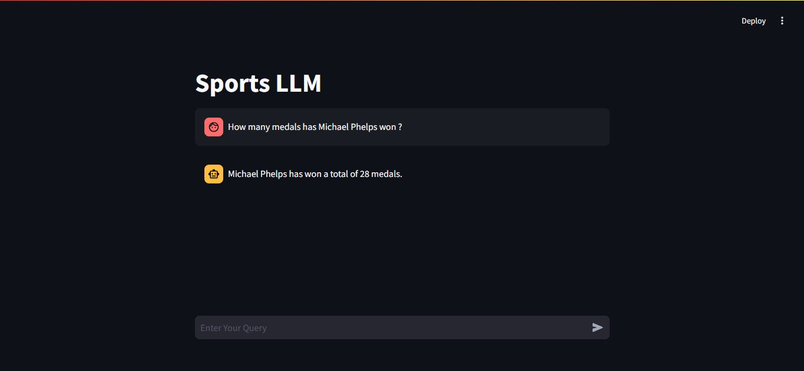

# Arena Insight: A Multi-Agent Approach to Navigating Olympic Data with LLMs

  


## **Table of Contents**
1. [Overview](#overview)
2. [Features](#features)
3. [Installation](#installation)
4. [Usage](#usage)
5. [Technologies Used](#technologies-used)
6. [License](#license)

---

## **Overview**

Arena Insight is an innovative project aimed at enhancing how users interact with Olympic data through a specialized large language model (LLM). It is designed to answer questions, summarize information, and generate text specifically related to the Olympics. The system operates on a robust multi-agent framework and integrates multiple data sources to provide accurate and context-rich responses.

The below diagram indicates the overall architecture of the system.


Below image illustrates a sample workflow of the system while processing a question.


Below image indicates how the UI of the application should look.



---

## **Features**

- Real-time query processing.
- Agentic Workflow: Built using LangGraph, the system routes queries through dedicated agents for SQL databases, vector databases, or web searches based on the query's nature.
- SQL Agent: Queries a MySQL-based data warehouse for analytical questions.
- Vector DB Agent: Retrieves information from a Chroma-based vector database for unstructured queries.
- Web Search Agent: Conducts web searches as a fallback mechanism when internal data sources lack relevant information.
- Query Processor: Oversees query routing and ensures sufficient context is gathered to generate accurate answers.

---

## **Installation**

### Prerequisites
Python 3.x and MySQL.

### Setup
1. Download the SQL and vector database data from this [link](https://drive.google.com/drive/folders/1iUGLdECJHsyuheCXLZ6gUXzXGj0wqKkW?usp=drive_link).
2. Create a MySQL database and import the SQL data into your local MySQL database using the below command :-
  ```bash
  use <database-name>;
  source <filename>.sql;
  ```
3. Fill the required environment variables in the `.env` file.
4. Install the required libraries using the below command :-
  ```bash
  pip install -r requirements.txt
  ```

---

## **Usage**

Run the application using the below command :-
```bash
streamlit run main.py
```

To test the application, add the queries on which the system is to be tested in `test_suite.py` and run the below command :-
```bash
python trulens_tester.py
```

Note :- The testing code works only in Linux based environments

---

## **Technologies Used**

- **Backend:** Python
- **Frontend:** Streamlit
- **Databases:** MySQL, ChromaDB
- **Testing:** TruLens for groundedness, context relevance and answer relevance.
---

## **License**

This project is licensed under the MIT License. See the [LICENSE](LICENSE) file for more details.
